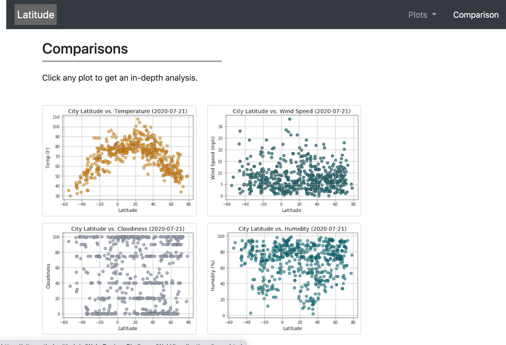

# Web-Design-Challenge
Utilizing HTML and CSS to create a dashboard showcasing the previous weather analysis I've done.

[Visit my site HERE!](https://gitgranthub.github.io/Web-Design-Challenge/WebVisualizations/index.html)

* My Data page displays a responsive table containing the data used in the visualizations. I used the Pandas 'to_html' tool.

* My Comparison page contains all of the visualizations on the same page so we can easily visually compare them.

* My Site looks great on small screens too! Notice the navbar color change when the screen size is small.

